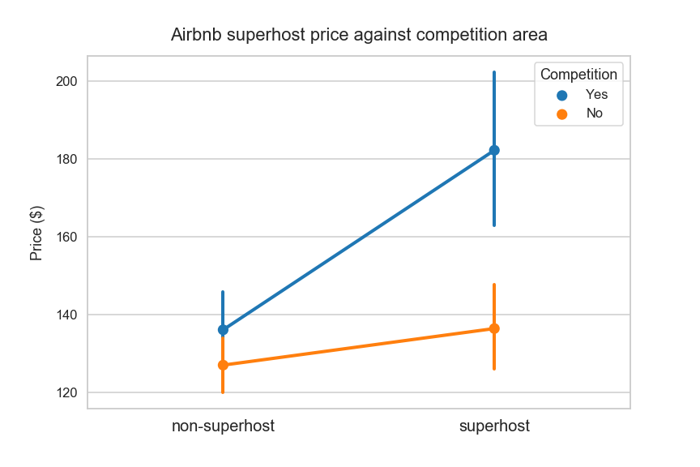
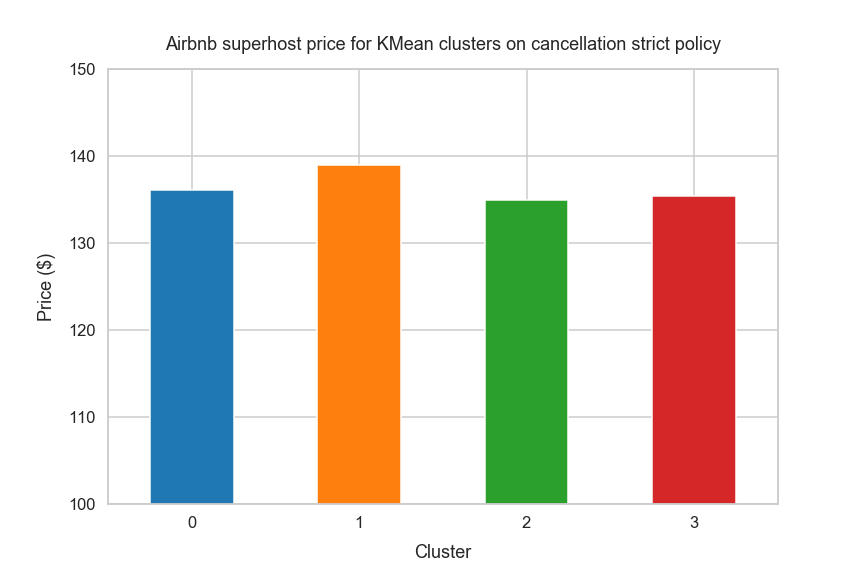
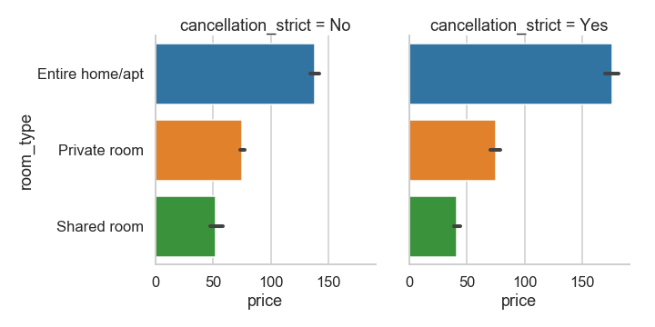
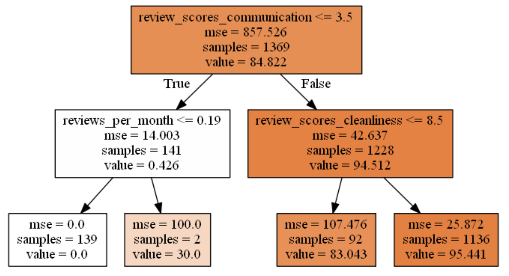

# Airbnb-Seattle-Data-Analysis

### Data 
This project used the following dataset, which are available in  (**Datasource**: [Airbnb Seattle Data](https://www.kaggle.com/airbnb/seattle))   
And you can check the data from  [**Here**](https://github.com/juliaYi/Airbnb-Seattle-Data-Analysis/tree/master/dataset).

### Tech Stacks
The project is mainly written in Python 3.6. I used pandas and numpy for data analysis, and used seaborn, and matplotlib for data visualization.
In addition, as for machine learning, I used sklearn lasso linear regression, gradient boosting, and KMean Clustering.
```
from IPython.core.interactiveshell import InteractiveShell
InteractiveShell.ast_node_interactivity = "all"
import pandas as pd
import seaborn as sns
import numpy as np
import os
%pylab inline
import matplotlib.pyplot as plt
import warnings
warnings.filterwarnings('ignore')

**lasso linear regression**
from sklearn import linear_model
from sklearn.linear_model import LinearRegression
from sklearn.linear_model import ElasticNet
from sklearn.tree import DecisionTreeRegressor
from sklearn.ensemble import GradientBoostingRegressor
from sklearn.neural_network import MLPRegressor
from sklearn.svm import SVR
from sklearn.model_selection import KFold
from sklearn.linear_model import Ridge
from sklearn.ensemble import RandomForestRegressor
from sklearn.preprocessing import LabelEncoder
import sklearn.tree as tree
from sklearn.model_selection import train_test_split
import sklearn
%matplotlib inline
%load_ext rpy2.ipython

**gradient boosting**
from sklearn.model_selection import train_test_split
X_train, X_test, Y_train, Y_test = train_test_split(X, Y, test_size=.4,random_state=0)

**KMean Clustering**
from sklearn.cluster import KMeans

**Find Best Clustering Method**
from sklearn import metrics
from sklearn.cluster import KMeans
from sklearn.cluster import Birch
from sklearn.cluster import AgglomerativeClustering

```
### Highlights 
**1. Does Airbnb price go against or go with Superhost?**<br>
'Superhosts' are experienced hosts who provide a shining example for other hosts, and extraordinary experiences for their guests. Once a host reaches Superhost status, a badge will automatically appear on their listing and profile to help you identify them.
Airbnb says that "Superhosts earn 22% more than other hosts* and benefit from a variety of rewards."
>After running regression to predict airbnb rent price for host, I found that superhost in more competitive regions charge higer rent than superhost in less competitive regions
  

**2. Does Airbnb price go against or go with hosts' cancellation policy?**
>After K-Mean clustering, I found a cluster which strongly go against with Airbnb price. Then, I figured out entire house hosts which take 66% of all the hosting tend to charge around 50 dollars more than others. 

  

**3. What does affect the most to review rating among location, communication and cleanliness?**
> After running decision tree analysis, I found that communication matters the most and cleanliness is the second most important to get high review rating.
   
